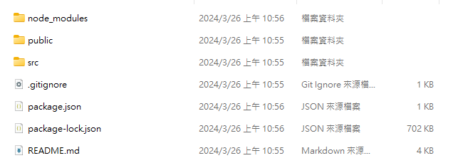
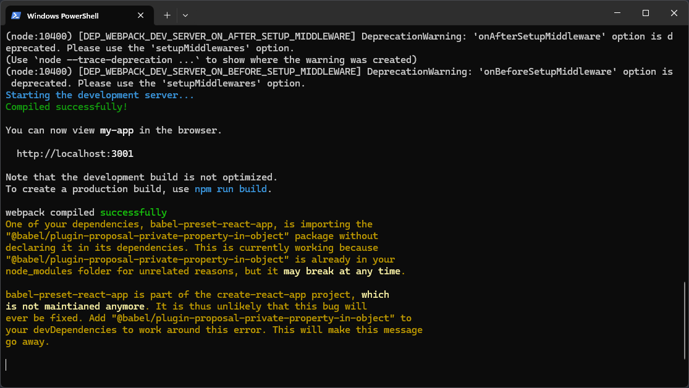
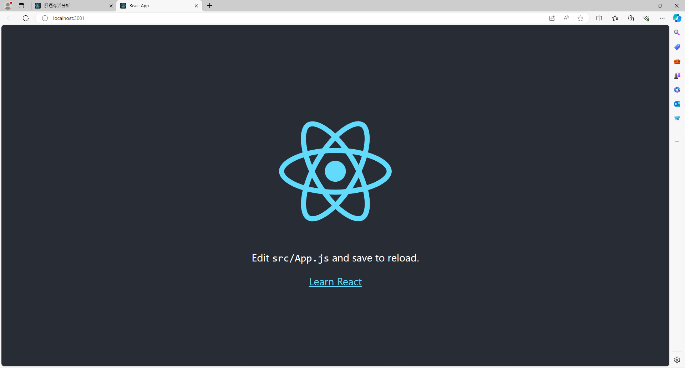

# NSYSU Lab 4080 網站架設手冊
@Author: Cellery 2024/03

## 簡述 Description
以肝癌預測網站為例，本文將介紹完整的網頁開發手冊。(當然您也可以有別的選擇)

架設網站的大致流程如下：
1. 前端開發
2. 後端開發
3. 包裝成 Docker 後移植到 Server 上
4. 執行該 Docker container

前兩步驟可以在您的電腦上進行開發，之後透過 Docker 把整個專案移植到伺服端即可。(Docker 可以想像為應用程式的容器，透過 Docker 包裝可以確保你的應用程式在別的電腦執行時不會有版本、相容性等問題。)

## 事前預備 Preparation
首先，您必須要具備以下知識
- 前端開發工具：Javascript (使用 nodejs)
- 後端開發工具：Python (使用 flask 框架)
- Docker
     
### 前端：Javascript, Nodejs and React
#### Javascript & Nodejs
Javascript (JS) 不需要額外安裝編譯器，您的瀏覽器(例如 chrome)就能執行。而 nodejs 是模組化的 js ，可讓開發者使用簡單明瞭的程式碼來建立快速、可擴充的網路應用系統。本專案選用 React 作為應用程式框架。

關於 js 開發方法請參閱後面「開發 Development」章節。

#### React

1. 安裝 nodejs: https://nodejs.org/
2. 建立一個資料夾，並用終端機開啟
3. 執行 ```npx create-react-app {專案名稱}```，程式會在資料夾內建立專案


4. ```cd``` 進專案資料夾，並執行 ```npm run```，程式會在電腦上啟動一個臨時 server，使用瀏覽器輸入終端機上顯示的網址(如 ```localhost:3000```)便可以看到。



以上便是 React 的安裝方式，開發方法請參閱後面「開發 Development」章節。

### 後端：Python and Flask
我們使用 Flask 做為後端的 api 框架，直接 ```pip install flask``` 就可以了。

### APP封裝：Docker
Docker 是一個應用程式的容器(Container)，只要妥善編寫 Dockerfile，開發者可以任意將自己的程式移植到任意平台或作業系統。可以大量規避版本和兼容性引發的程式錯誤。

安裝 Docker Desktop: https://www.docker.com/products/docker-desktop/


## 開發 Development
開發時請不要無腦開發，請先規劃好應用程式的思路。請以**使用者**的角度來思考該如何設計應用程式的前後端。
- 前端開發：以使用者的角度出發，如何設計出直覺的介面，提供幾點建議
    - 避免使用文字說明，以直覺的符號取代冗長的文字說明
    - 所有的功能要在三次點擊內到達
    - 把使用者當笨蛋 - 任何使用者輸入的資料都要做格式檢查，若格式有誤，不要把資料送到後端(例：可以把送出按鈕 disable 掉)

- 後端開發：以維護性的角度出發，以便後續的擴充或修改
    - 盡量使用物件導向的邏輯進行編寫，不同功能用不同 class 包裝，以免變數被汙染

### 前端開發
#### Javascript
我認為所有語法都可以慢慢學，唯一要先瞭解的只有兩個：js的非同步屬性及function 的宣告方式。
- js 非同步：因為js要串聯前後端，有時候在執行某項任務時，程式並不知道要執行多久(例如從遠端抓取大量資料)，而此時又不能等它跑完才繼續執行，否則前端會整個卡住。所以 js 發展出了非同步的屬性，簡單來說就是它同時執行多個函數。https://ithelp.ithome.com.tw/articles/10194569

- 函數宣告


#### Build
`npm run build`之後，記得把 ./frontend/build 中的 static 和 index.html flask 的專案下，並在後端指定入口

```python
app = Flask(__name__, template_folder='../templates', static_folder='../static')
```

`template_folder` 裡面放 html.index
`static_folder` 為 static 資料夾

### 後端

## Dockerize
### Dockerfile

```dockerfile
FROM python:3.10
WORKDIR /code
ADD . /code
RUN pip install -r requirements.txt
CMD ["python", "./api/app.py"]
```